# Actividad1(Guiada)

***(Para completar correctamente la actividad habrá de realizar un archivo PDF con las capturas necesarias para demostrar que ha realizado la actividad)***

(Lo aconsejable para realizar es contar con máquinas Ubuntu 18.04 que es donde se han realizado las pruebas, y que tengan instalado tanto webmin como filezilla, si no se cuenta con webmin este link te llevará a un tutorial sobre como instalarlo,importante poder utilizar permisos de root en la máquina). [https://clouding.io/kb/como-instalar-webmin-en-ubuntu-18-04/]

Una vez tengamos todo listo podemos empezar:

**1.** Lo primero de todo es crear el usuario pero, ¿cómo haremos eso? muy sencillo accedemos a este apartado dentro de webmin.

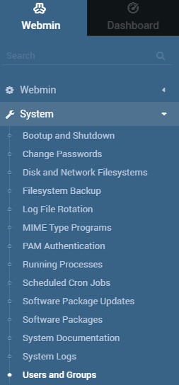

**2.** Una vez estemos ahí accederemos donde pone **users and groups**, una vez lo hagamos se nos abrirá este asistente:

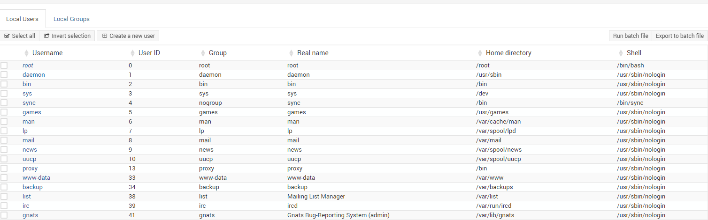

**3.** Una vez estemos ahí tendremos que darle a **create new user** cuando le demos nos abrirá un asistente nuevo:

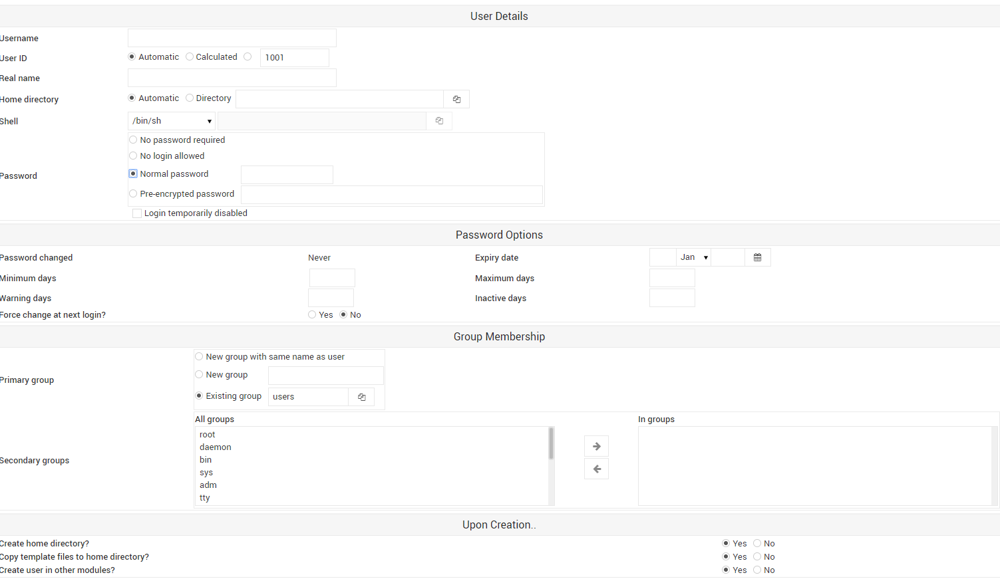

Aquí es donde le daremos un nombre de usuario, para tenerlo mejor organizado lo llamaremos usuarioftp y la contraseña  le pondremos la que queramos nosotros. Después de este paso y de darle a **save changes** ya tendríamos el usuario creado, ahora pasaremos a crear el grupo ftp para tenerlo todo mejor organizado:
(**¡IMPORTANTE! PONER CONTRAEÑA DE LA CUAL NOS ACORDEMOS**)

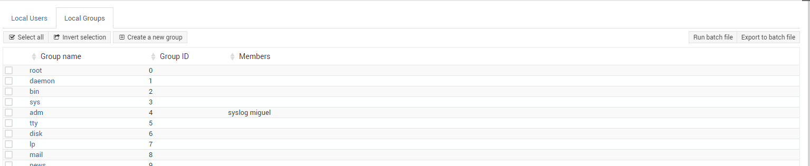

**4.** Y al igual que con los usuario tendremos que clickar en **create new group** y se abrirá un asistente:

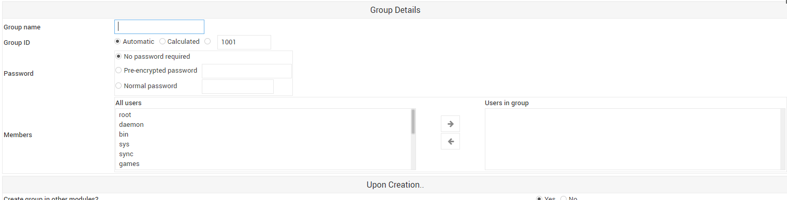

Aquí le pondremos el nombre del grupo, y en la parte de abajo donde pone **Members** buscaríamos el usuarioftp que hemos creado y lo uniríamos al grupo. 

**5.** Ahora vamos a comprobar que efectivamente nuestro usuario se puede conectar al servidor:(*Para conectarnos al servidor tenemos que poner ftp dirección ip del servidor*)

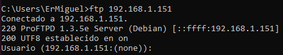

Como podemos observar nos pide un nombre usuario, simplemente tendríamos que escribir el nombre que hemos creado antes, una vez lo ingresemos nos pedirá la contraseña, por eso es importante que os acordéis de ella:

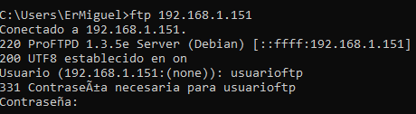

Una vez nos conectemos correctamente nos aparecerá este mensaje de confirmación:

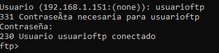

**6.** Ahora viene una parte un poco más díficil, que es la denegación a un usuario específico, por defecto FTP "banea" a un número de usuarios, pero, (¿y si nosotros quisiéramos "banear" a uno en específico?), lo primero que debemos hacer es acceder al apartado de wembin llamado **Un-used Modules** y buscar **ProFTPD Server** nos debería aparecer así:

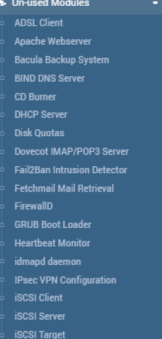 
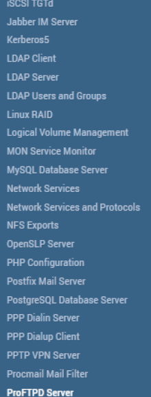

Lo tendremos que instalar y una vez lo instalemos nos aparecerá esto:

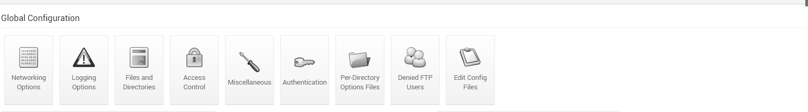

Si sabemos un poco de inglés ya sabemos donde tendremos que acceder, pero por si acaso tendremos que acceder a **Denied FTP Users** y una vez le demos nos saldrá una lista de usuarios, esos usuarios son los que tienen prohibida la entrada a nuestro servidor por así decirlo, para hacer la prueba crear un usuario llamado usuariodenegado y agregarlo a esa lista.

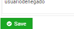

**7.** Bien, una vez todo hecho vamos a probar a conectarnos con ese usuario.

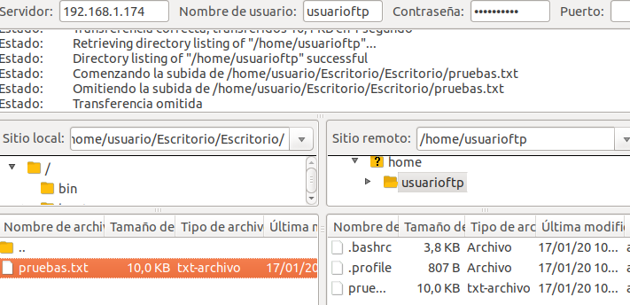

Nos dará un error de login incorrecto, pero no es que hayamos puesto mal la contraseña, es que nosotros no le dejamos, aunque si nos fijamos parece que nos haya conectado no, ¿verdad?, bien vamos a probar a coger un archivo (si queréis crearlo para hacer la prueba, pero no es necesario, eso si, si vais a hacer la prueba aseguraos de darle los permisos adecuados al archivo).

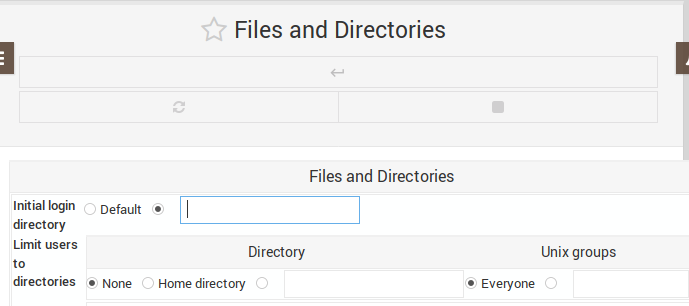

**8.** Ya vemos el problema ¿verdad? bien ahora vamos a hacer esto mismo pero con FileZilla a ver que pasa, primero crearemos un archivos en el escritorio del usuario.

Una vez creado abriremos FileZilla.

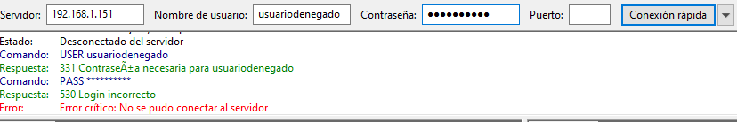

Vemos que nos salta el mismo de Login Incorrecto ,en este no nos deja conectarnos al servidor.

**9.** Bien ahora vamos a probar con el primer usuario que hemos creado, a ese no le hemos betado la conexión ni nada, veamos que pasa si nos conectamos con él.

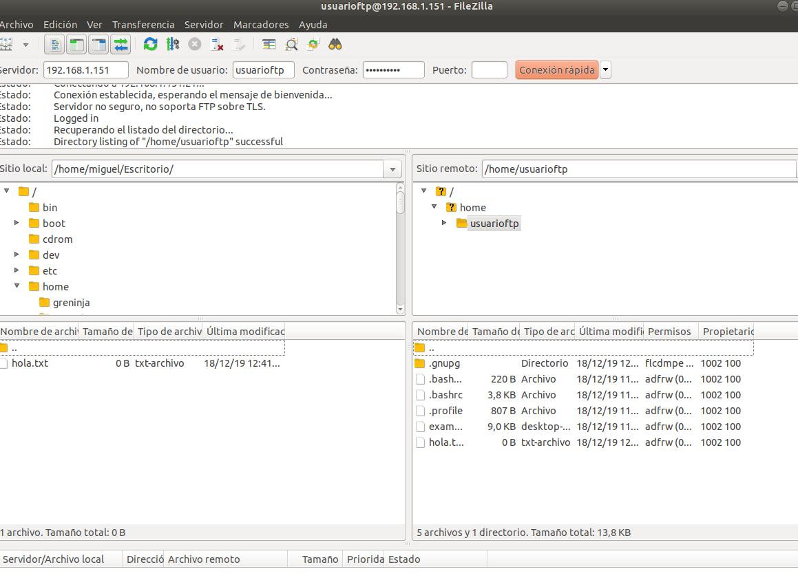

Como vemos en la parte de la izquierda vemos los archivos del usuario desde el que hemos accedido al servidor y en el apartado de la derecha vemos los archivos con los que cuenta nuestro usuarioftp, para subir el archivo simplemente tendríamos que arrastrar el archivo deseado a nuestro usuario FTP.

Si funciona correctamente habremos comprobado que los usuarios funcionan tal y como deseamos.
Y como último paso vamos a probar a enjaular los usuarios, esta función sirve principalmente para que los usuarios no naveguen con libertad por todos nuestros archivos y se hace con dos sencillos pasos:

**20.** Como hemos dicho vamos a enjaular a los usuarios, para ello el primer paso sería acceder al archivo de configuración de la siguiente forma:

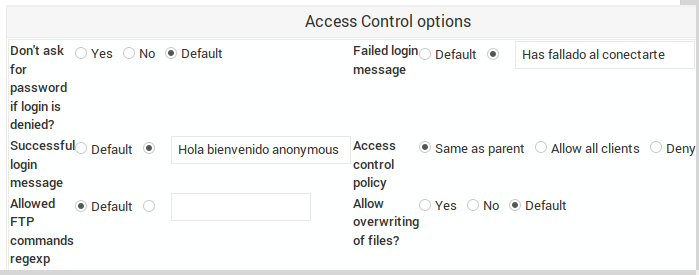

Tendremos que acceder a "Edit Config Files" y una vez accedamos veremos un archivo de texto enorme, pero no hay porque asustarse, a nosotros solo nos interesa una línea de texto y es la que pone: DefaultRoot que es la que tendremos que editar.

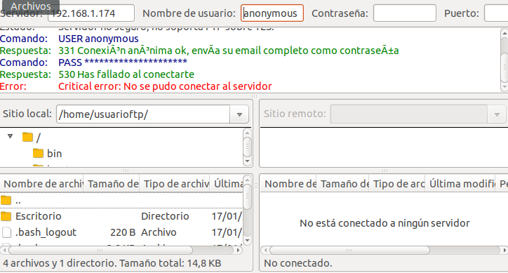

El primer paso sería borrar la almohadilla para que así haga la función que nosotros le digamos, a continuación dejando un espacio indicaremos la ruta de donde queremos enjaular el usuario para que solo pueda trabajar en ese directorio que nosotros le asignemos y después mediante otro espacio indicaremos el usuario o grupo de usuarios que queremos que este enjaulado.

Y por último mediante la herramiento de FileZilla vamos a comprobar que efectivamente nuestro usuario está "encerrado" en ese directorio.

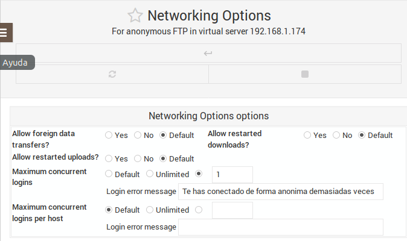

*Una vez adjuntes la captura de todas las actividades habrás finalizado con éxito esta actividad*

[Volver a la página principal](README.md)
