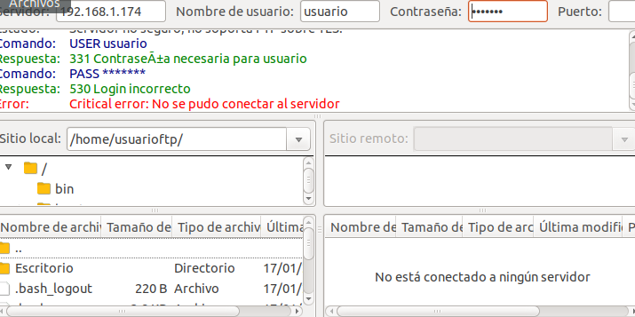
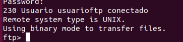
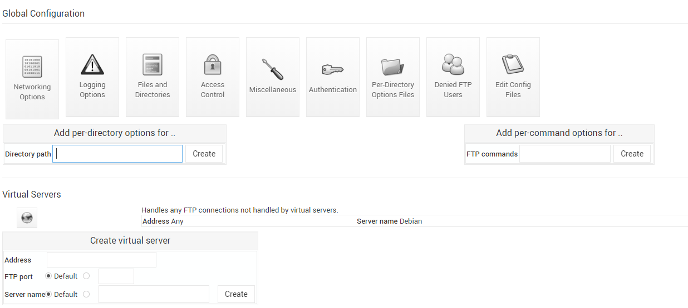
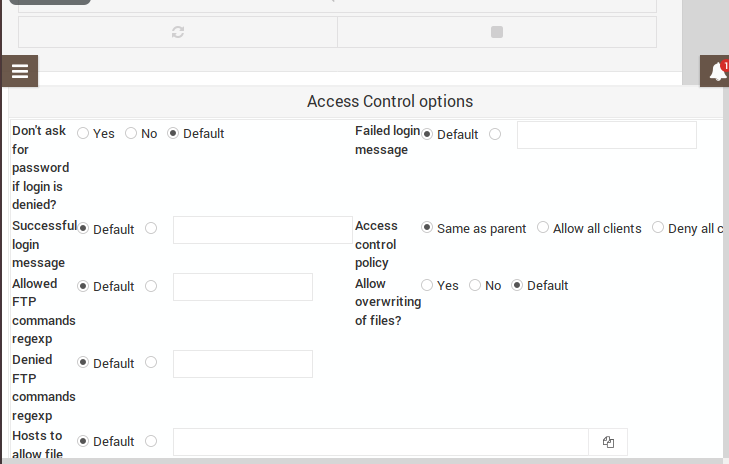
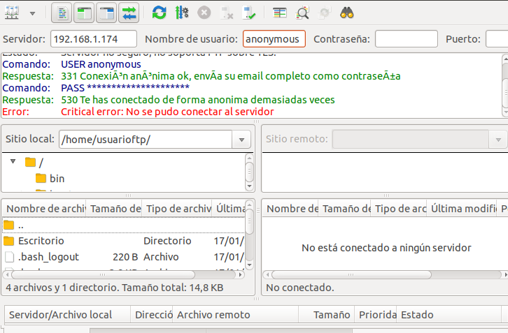

# Actividad1(Guiada)

Vamos a realizar una actividad en la que aprenderemos a configurar los permisos y los modos de acceso de los usuarios al servidor.

(Lo aconsejable para realizar esta actividad es contar con máquinas Ubuntu 18.04 que es donde se han realizado las pruebas, y que tengan instalado tanto webmin como FileZilla, si no se cuenta con webmin este link te llevará a un tutorial sobre como instalarlo,importante poder utilizar permisos de root en la máquina). [Guía instalación Webmin](https://clouding.io/kb/como-instalar-webmin-en-ubuntu-18-04/)

Por defecto, los usuarios que están en nuestra máquina donde tenemos instalado el servidor, se pueden conectar al servidor, usando sus propias credenciales(nombre de usuario, contraseña...) y cuando se conectan, de manera predeterminada el usuario está navegando por su propio */home* y si nosotros no configuramos los permisos es capaz de navegar por cualquier directorio.

Comenzaremos con una pequeña guía sobre como crear usuarios en nuestra máquina desde Webmin: (si no quieres crearlo pasa directamente al paso 5.)

**1.** Lo primero de todo es crear el usuario pero, ¿cómo haremos eso? muy sencillo, accedemos a este apartado dentro de webmin.

**2.** Una vez estemos ahí, accederemos donde pone **users and groups**, una vez lo hagamos se nos abrirá este asistente:

**3.** El siguiente paso sería que tendremos que darle a **create new user**, cuando le demos nos abrirá un asistente nuevo:

Aquí es donde le daremos un nombre de usuario, para tenerlo mejor organizado lo llamaremos usuario y la contraseña le pondremos la que queramos nosotros. Después de este paso y de darle a **save changes** ya tendríamos el usuario creado, ahora pasaremos a crear el grupo ftp para tenerlo todo mejor organizado:
(**¡IMPORTANTE! PONER CONTRASEÑA DE LA CUAL NOS ACORDEMOS**)

**4.** Y al igual que con los usuario tendremos que clickar en **create new group** y se abrirá un asistente:

Aquí le pondremos el nombre del grupo, y en la parte de abajo donde pone **Members** buscamos el usuario que hemos creado y lo unimos al grupo. 

**5.** Una vez hemos acabado de crear el usuario podremos empezar a configurarlos para darles una serie de permisos y acciones que puedan hacer dentro del servidor y algunas que no.

Una de las cosas que podemos hacer es accediendo a  ***Acces Control*** 

Nos aparecerán una serie de opciones interesantes, como por ejemplo que nos muestre un mensaje si accedemos correctamente, o si fallamos al loguearnos.

Otra cosa interesante que podemos hacer es configurar el límite de capacidad que tienen los usuarios para la subida de archivos, esto se configura desde Miscellaneous.

En el apartado donde dice ***Memory resource limits*** le pondremos un límite para hacer la prueba, el límite puede ser el que vosotros elijáis, eso sí no pongáis un límite muy grande que si no habría que crear muchos archivos o un archivo de más o menos el tamaño que le especifiquéis, para la prueba usaremos el FileZilla ya que es más cómodo.(*Para establecer los límites de tamaño hay que establecerlo como B=Bytes, K=KyloBytes...)

En mi caso la prueba es de límite de 10KB, y en esa imagen vemos que el archivo pruebas ocupa 10KB y me ha dejado subirlo al servidor sin problemas, pero, ¿qué pasaría si volvemos a intentar subirlo?

Como vemos en los mensajes de FileZilla nos muestra un error y acaba omitiendo la subida del archivo.

Otra de las opciones que podemos configurar es a que directorio queremos que se conecte directamente, esto se configurar desde ***Files and Directories** y es en el apartado de ***Initial login directory***, en este caso para hacer la prueba yo le he asignado el directorio *raíz /*, pero vosotros podéis poner el que queráis.

Una vez rellenemos ese apartado, vamos de nuevo a FileZilla y al conectarnos al servidor veremos esto:

Nos muestra donde hemos accedido de primeras.

**6.** Ahora viene la parte de denegar usuarios, como su propio nombre indica se trata de la denegación a un usuario específico. Por defecto FTP impide el acceso  a un número de usuarios, pero,¿y si nosotros quisiéramos "banear" a uno en específico?, lo primero que debemos hacer es acceder a la **Global Configuration** y en el apartado de Denied FTP Users podemos ver la lista de usuarios que no pueden acceder al servidor, si nosotros quisiéramos hacer la prueba simplemente tendríamos que escribir el nombre del usuario al que queremos impedir el acceso.

**7.** Bien, una vez todo hecho vamos a probar a conectarnos con ese usuario.

Como vemos nos da un error y por tanto no nos deja conectarnos. Si quisiéramos volver a permitir que el usuario se conecte simplemente borramos su nombre de la lista de usuarios denegados y ya volvería a funcionar correctamente.

***Enjaulamiento usuarios***

**8.** Como siguiente paso vamos a hablar sobre el enjaulamiento de usuarios, este es un paso para darle más seguridad al servidor, ya que limitamos al usuario a que solo pueda navegar dentro de la ruta que nosotros le especifiquemos.(*Si en los pasos anteriores has puesto que se conecte directamente a la raíz / cambialo, si no dará un error y el usuario no se enjaulará*), para enjaularlo tendremos que acceder a **Edit Config Files**, lo primero que veremos es un archivo de texto, tenemos que buscar una línea de texto que nos aparecerá de la siguiente manera: #DefaultRoot tendremos que quitarle la almohadilla y especificar la ruta donde queremos enjaular al usuario que también especificaremos en esta línea de texto como se ve en la siguiente imagen:

Bien, ahora vamos a comprobar que efectivamente está enjaulado en la ruta que le hayamos especificado, si todo ha salido bien nos tendría que aparecer así:

Si probáramos a salir de /home veríamos que no podemos. 

***Configuración FTP Anonimo***

**9.** El último paso respecto a la configuración de usuarios, sería la configuración anónima del servidor, accedemos a nuestro servidor y veremos que hay una opción que se llama anonymous FTP, tendremos que acceder a ella y aparecerá lo siguiente: 

Si no tenemos el grupo ftp creado seleccionar la opción de Default, una vez le demos a Create se nos abrirá una nueva serie de opciones para configurar el usuario anónimo:

De todos los apartados que salen tendremos que acceder a ***Authentication*** y aparecerá lo siguiente:

De estas opciones muy importante que marquemos no en la opción de *only allow login by users with valid shell?* Si no, no podremos acceder al servidor, ahora vamos a probar a conectarnos al servidor como anónimo, para hacer esto cuando nos pregunte por el usuario tendremos que poner anonymous y contraseña no es necesario que pongamos nada.

Como vemos efectivamente nos hemos conectado sin problemas, pero vamos a configurar para que no pueda hacer todo lo que quiera un usuario que se conecte de forma anónima.

Otra de las opciones interesantes, es dentro de ***Acces Control*** podemos establecer un mensaje que aparezca cuando se conecte de manera correcta, también hay algunas opciones interesantes como por ejemplo denegar la utilización de comandos dentro del servidor y alguna que otra más, por ahora vamos a probar la opción de *succesful login message*, como dato curioso, si hacemos la prueba desde FileZilla el mensaje de bienvenida no aparecerá, pero si accedemos desde la terminal el mensaje efectivamente aparecerá.

Tanto el mensaje de bienvenido como el de error podéis poner el que queráis. Yo he puesto estos:

Si queremos probar la opción de ***Failed login message***, tendremos que volver a dejar la opción *only allow login by users with valid shell?* en *default* para que nos aparezca el mensaje de error, en este caso si nos aparece el mensaje incluso en FileZilla.

Y por último vamos a limitar el número de veces simultáneas que puedes conectarte al servidor de forma anónimo, en ***Networking Options*** veremos una opción llamada ***Maximum concurrent logins***, en esa opción podremos limitar las veces que puede conectarse al servidor y el mensaje de error que queremos que aparezca.

Si de límite has puesto 1 como yo, si abres otra conexión con el servidor saldrá el mensaje de error que le hayamos especificado.

Y después de este paso, habrás terminado la actividad.

[Volver a la página principal](README.md)
