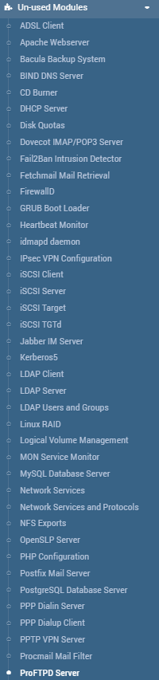
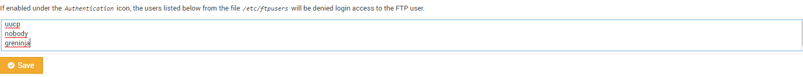

# Actividad1(Guiada)

(Lo aconsejable para realizar es contar con máquinas Ubuntu 18.04 que es donde se han realizado las pruebas, y que tengan instalado tanto webmin como filezilla, si no se cuenta con webmin este link te llevará a un tutorial sobre como instalarlo,importante poder utilizar permisos de root en la máquina). [https://clouding.io/kb/como-instalar-webmin-en-ubuntu-18-04/]

Una vez tengamos todo listo podemos empezar:

1.Lo primero de todo es crear el usuario pero, ¿cómo haremos eso? muy sencillo accedemos a este apartado dentro de webmin.

2.Una vez estemos ahí accederemos donde pone **users and groups**, una vez lo hagamos se nos abrirá este asistente:

3.Una vez estemos ahí tendremos que darle a **create new user** cuando le demos nos abrirá un asistente nuevo:

Aquí es donde le daremos un nombre de usuario, para tenerlo mejor organizado lo llamaremos usuarioftp y la contraseña  le pondremos la que queramos nosotros. Después de este paso y de darle a **save changes** ya tendríamos el usuario creado, ahora pasaremos a crear el grupo ftp para tenerlo todo mejor organizado:
(**¡IMPORTANTE! PONER CONTRAEÑA DE LA CUAL NOS ACORDEMOS**)

4.Y al igual que con los usuario tendremos que clickar en **create new group** y se abrirá un asistente:

Aquí le pondremos el nombre del grupo, y en la parte de abajo donde pone **Members** buscaríamos el usuarioftp que hemos creado y lo uniríamos al grupo. 

5.Ahora vamos a comprobar que efectivamente nuestro usuario se puede conectar al servidor:(*Para conectarnos al servidor tenemos que poner ftp dirección ip del servidor*)

Como podemos observar nos pide un nombre usuario, simplemente tendríamos que escribir el nombre que hemos creado antes, una vez lo ingresemos nos pedirá la contraseña, por eso es importante que os acordéis de ella:

Una vez nos conectemos correctamente nos aparecerá este mensaje de confirmación:

6.Ahora viene una parte un poco más díficil, que es la denegación a un usuario específico, por defecto FTP "banea" a un número de usuarios, pero, (¿y si nosotros quisiéramos "banear" a uno en específico?), lo primero que debemos hacer es acceder al apartado de wembin llamado **Un-used Modules** y buscar **ProFTPD Server** nos debería aparecer así:

Lo tendremos que instalar y una vez lo instalemos nos aparecerá esto:

Si sabemos un poco de inglés ya sabemos donde tendremos que acceder, pero por si acaso tendremos que acceder a **Denied FTP Users** y una vez le demos nos saldrá una lista de usuarios, esos usuarios son los que tienen prohibida la entrada a nuestro servidor por así decirlo, para hacer la prueba crear un usuario llamado usuariodenegado y agregarlo a esa lista.

[Volver a la página principal](README.md)
